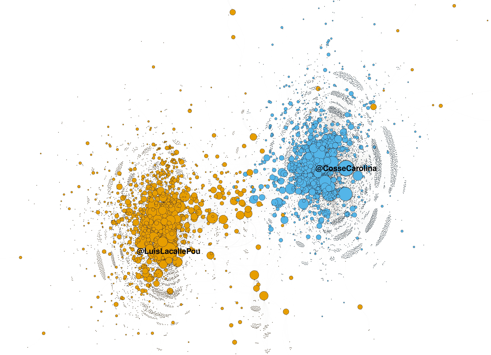

# ComunidadesTwitter
## Detección de comunidades políticas en Twitter y posibles aplicaciones
### (trabajo aceptado para presentación en LatinR 2020)

Los estudios académicos sobre el uso político de redes sociales han proliferado en tiempos recientes. Pese a las obvias bondades de trabajar con datos de redes sociales (prinicpalmente, estudiar comportamiento real, en tiempo real), existe una importante limitación en el acceso a información relevante a nivel individual. Por ejemplo, en el caso de Twitter, no es posible obtener información relevante a nivel individual sobre los usuarios que participan en una discusión política dada. Sin embargo, existen ciertas estrategias para inferir actitudes políticas de los usuarios de Twitter. Una de ellas es la detección de comunidades políticas mediante la aplicación de técnicas de teoría de redes, en particular, la detección de comunidades. En teoría de redes se utiliza la detección de comunidades para identificar subgrafos cuyos nodos están altamente conectados entre sí pero conpoco conectados con otros grupos de nodos. La idea subyaciente es identificar subgrupos cohesivos (Borgatti, 2013). En este trabajo muestro una aplicación de esto en R y potenciales usos. 
 

